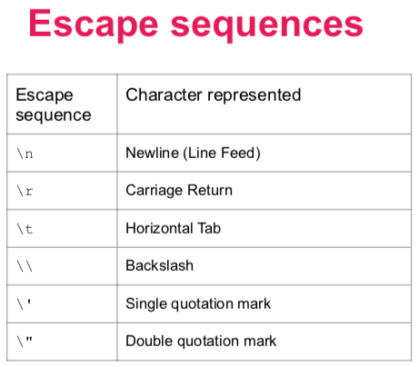
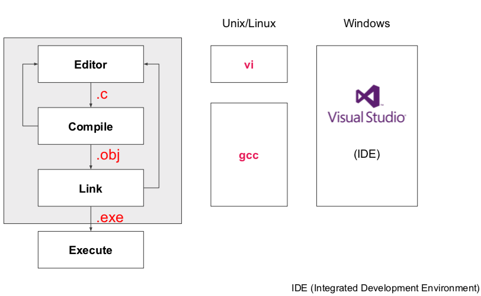
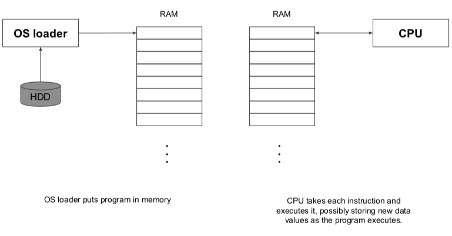
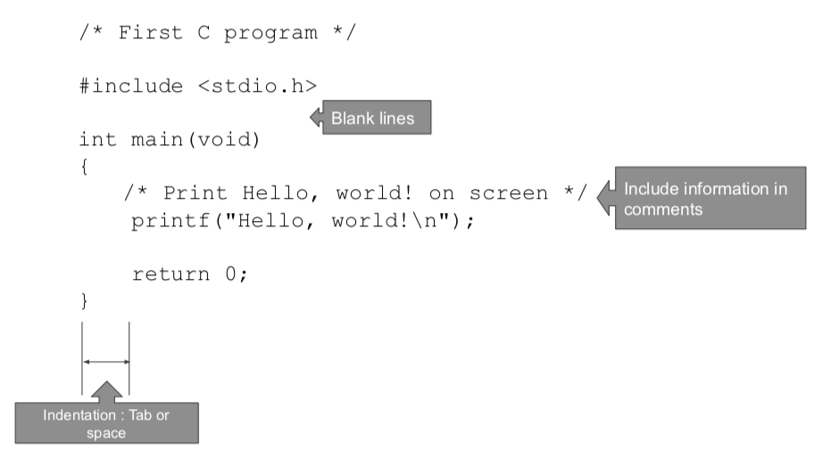

# First Class

> What is C?

Ken Thompson and Dennis Ritchie are the inventor of the C programming language. C was originally developed by Dennis Ritche between 1969 and 1973 at Bell Labs, and used to re-implement the Unix operating sydtem. C has been standardized by ANSI since 1989 and subsequently by the ISO.


> Why C?	

- Low level control
- Performance
- Protability


> C programming language cons

- Should understand computer structure 
- Hard to learn


>First C program to print "Hello, World!"

```c
/* First C Program */
// Lecture 1-1

#include <stdio.h>

int main(void)
{
  printf("Hello, world!\n");
  
  return 0;
}
```

> Comments 

```c
/*
	This is the comment 
	Ignored by the compiler
*/

//This is the comment
//Ignored by the compiler
```

> Preprocessing directive

Process "something" before compilation.

- "#include" includes stdio.h file in the code.
- .h : header file
- <> : File exists in "pre-defined path"
- <stdio.h> contains information about printf() function.

> Main function

- Every C program has "main" function.
- Computer begin execution from "main" function.

>Function in C

- "main" function returns 0.
- Each statement ends with ";".

> Printf function

Standard library function to output formatted string on screen

(standard output)

- input argument of printf function is "Hello, world!\n"
- \n is "new line" (escape sequence)


> Escape Sequence



- \n : Newline (Line Feed)
- \r : Carrige Return
- \t : Horizontal Tab
- \\\ : Backslash
- \\' : Single quotation mark
- \\" :  Double quotation mark


```c
#include <stdio.h>
int main(void)
{
  printf("Hello, world!\n");
  return 0;
}
```

```c
#include <stdio.h>
int main(void)
{
  printf("Hello, ");
  printf("world!\n");
  return 0;
}
```

```c
#include <stdio.h>
int main(void)
{
  printf("Hello, world!\n");
  printf("Hello, universe!");
  return 0;
}
```

```c
#include <stdio.h>
int main(void)
{
  printf("Hello, world!\nHello, universe!\n");
  return 0;
}
```


> C Programming Process



- 1. Editor : Make source code file.
- 2. Compile : Make object file.
- 3. Link : Relocation object code information, other object files, modules, and library files.
- 4. Execute : Make exe file.


>Execution Process



OS loader puts program in memory. HDD -> RAM : speed fast

CPU reads command from RAM.

CPU takes each instruction and executes it. It can possibly storing data values as the

program executes.

*Embeded System - HDD(x) Flash memory(o)

Then, execution file doesn't go to the RAM. It goes only Flash Memory.

Speed : (HDD < Flash Memory < RAM)


> Coding Style



If you enter the company, you may learn coding rules. It is vert important in team project.

Ex) if {           or          if 

}									{

​										}